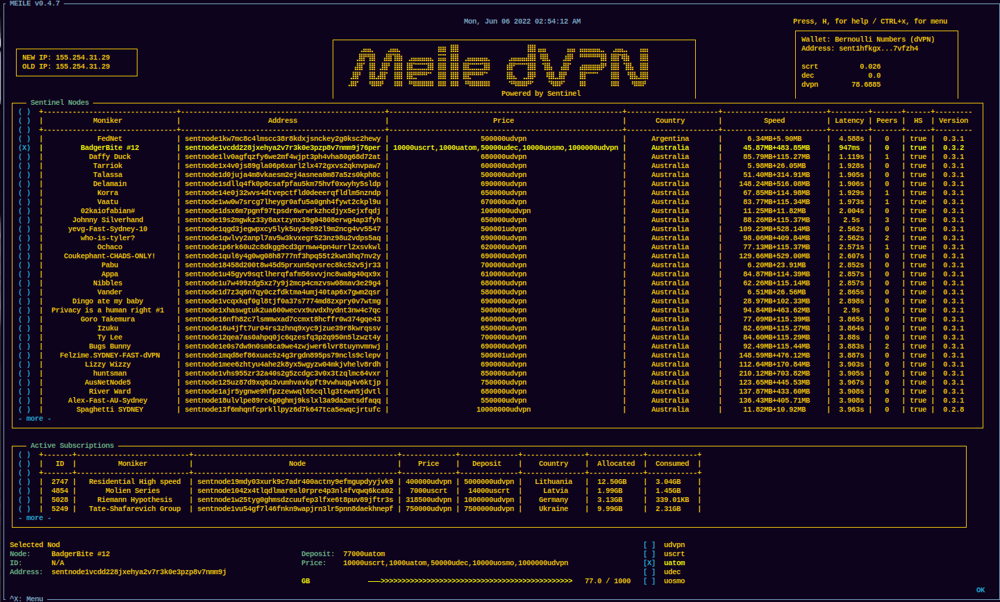

# Meile (may•lah)
[](https://github.com/MathNodes/meile/blob/main/LICENSE)
[](https://github.com/mathnodes/meile/stargazers)
[](https://github.com/mathnodes/meile/network)
[](https://github.com/mathnodes/meile/issues)

A Sentinel Network dVPN TUI client. 

## Dependencies
[sentinel-cli](https://github.com/sentinel-official/cli-client)

You will need this in order for Meile to operate. Future versions of meile will ship with sentinel-cli. For now, please download and configure your wallet with the sentinel-cli app. 

## Install (pip)

Open up a terminal and run:

```shell
pip install meile
```

To start Meile simply run:

```shell
meile
```

## Upgrading for non-pip to pip
```shell
rm -rf ~/.meile
pip install meile
```

Then re-enter your wallet name and address. Ez. 

## Intall (source)

```shell
git clone https://github.com/MathNodes/meile
```

Build
```shell
cd meile && python3 -m build
```

Install
```shell
python3 setup.py install
```

Run:
```shell
meile
```

It will prompt you or your Wallet Name and Wallet Address. Meile will store this information in the `$HOME/.meile/config.ini` for future processing.

## Screenshot


## Notes
Please address all issues in the **issues** section of this repo. We will work
to fix any issues or add enhancments people may suggest. 

## Tipjar
You tip a waiter/waitress for their service, why not tip a programmer for their code?

### Sentinel (dvpn)


```shell
sent1hfkgxzrkhxdxdwjy8d74jhc4dcw5e9zm7vfzh4
```


### Monero (xmr)


```shell
8A8TesuUctMQzq1oNM5VWQeZxu5SPDQyf87yMUdvPfSxjXQKvZSY3F7Dm9zGD3uKXbQ6ZMXGRydyQAGGQvBSfeVZBtJxh8A
```


